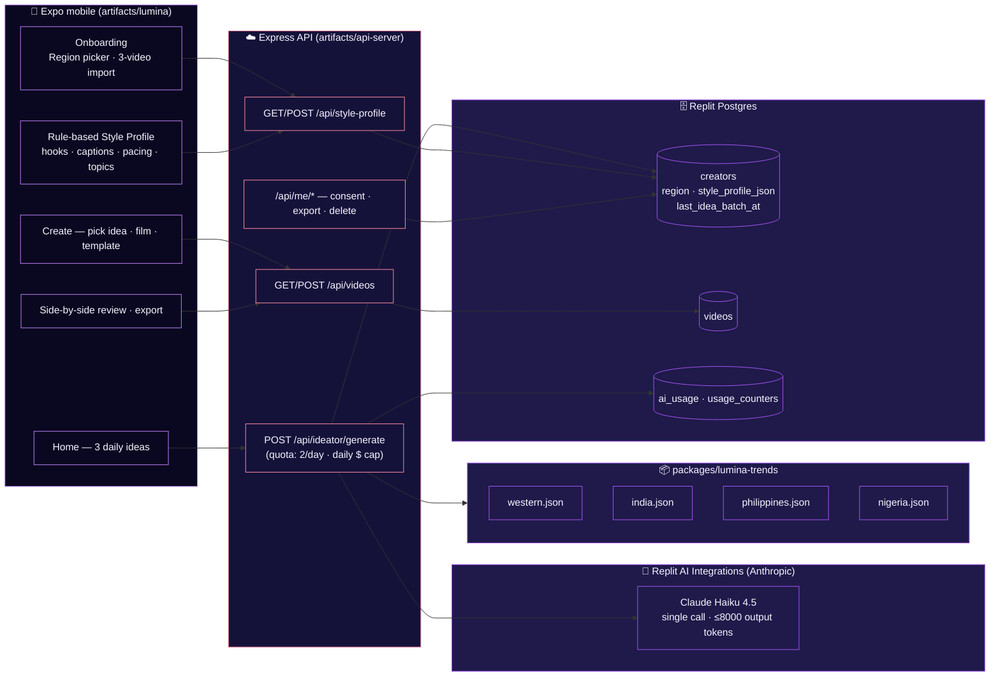

# Lumina — Architecture (Phase 1 MVP)

> **Current scope:** Phase 1 MVP only. Day-1 markets: US (primary), UK, CA, AU, IN, PH, NG.
> Locked spec: [`attached_assets/Pasted-LUMINA-PHASE-1-MVP-FINAL-LOCKED-SPEC*`](attached_assets/).
>
> **Earlier v2.0 blueprint** (autonomous swarm, on-device Llama/Mistral/Qwen, Compliance Shield, Stripe Connect, brand-deal router, 99.8 % Style Twin clone, 12-variant A/B publisher) is **archived** — see [§ Archived v2.0 blueprint](#archived-v20-blueprint) at the bottom of this document for historical context.

---

## Architectural principles (Phase 1)

1. **One small cloud LLM call per surface.** No autonomous orchestrator, no overnight swarm. The Ideator is the only AI surface in v1; everything else is rule-based or template-based.
2. **Region-conditioned, not on-device-clone.** The creator's "voice" comes from a lightweight rule-based **Style Profile** extracted from 3+ uploaded videos, fed into the Ideator alongside a static regional **Trend Bundle**. No vector DB, no quantized model, no 99.8 % clone target.
3. **Templates, not dynamic AI cutting.** Creation uses one of four fixed timing templates (A/B/C/D), deterministically selected from the idea's hook type.
4. **Static trends, refreshed manually.** No real-time scraping. Each region ships ~25 hooks + 15 captions + 10 formats as a versioned JSON bundle in [`packages/lumina-trends`](packages/lumina-trends).
5. **Cost discipline.** A per-creator daily AI spend cap (`$5` default) sits in front of the only LLM call. Two ideator batches per UTC day (one normal + one regenerate).
6. **Privacy by minimisation.** The Ideator never sees raw footage. Only the Style Profile JSON + region + a regenerate flag cross the wire. Consent surface (`/api/me/*`) supports withdraw / export / delete.

---

## System overview



---

## The five surfaces of v1

| Surface | Where it lives | What it does | Notes |
|---|---|---|---|
| **Onboarding** | mobile · `app/(onboarding)/*` | Region picker + 3-video gallery import | Region: `western` (US/UK/CA/AU) · `india` · `philippines` · `nigeria`. Changeable in Settings. |
| **Style Profile** | mobile (rule-based extraction) + API (`POST /api/style-profile`) | Hook type · caption tone · pacing · topics · content type → JSON | Stored on `creators.style_profile_json`. Defaults sensibly when missing so the Ideator works pre-onboarding. |
| **Daily Ideator** | API · `POST /api/ideator/generate` | Region-conditioned ideas with hard constraints | One LLM call. Ideas must be **understandable in <3s** (hook ≤3s · ≤8 words) and **shootable in <30 min**. Output cap clamps both. |
| **Templated creation** | mobile · `app/create/*` | Pick idea · film on native camera · template-based edit | Four fixed templates: A Fast Hook · B Story Build · C POV/Relatable · D Trend Jack. Selected deterministically from `templateHint`. |
| **Side-by-side review + export** | mobile · `app/review/*` | Past video left · Lumina version right · plain-English diff · one-tap export | "Make another version" reuses the same idea with hook variation or different template. |

---

## The four fixed templates

Deterministic selection from `idea.templateHint` returned by the Ideator. No dynamic AI cutting in v1.

| Template | Best for | Timing |
|---|---|---|
| **A — Fast Hook** | Question or bold-statement openers (educational / entertainment) | 0–2s hook overlay · 2–5s reveal · 5–12s main · 12–18s payoff |
| **B — Story Build** | Narrative · twist · reveal | 0–3s scenario hook · 3–10s build · 10–20s twist |
| **C — POV / Relatable** | Personal · talking-head · lifestyle | 0–3s direct-to-cam hook · 3–12s story · 12–18s CTA |
| **D — Trend Jack** | Trend-based · audio-driven | 0–1.5s trending audio sync · 1.5–6s visual match · 6–15s cultural twist |

Auto-captions match the creator's profile (emoji count ±1, sentence-length range, tone). Audio packs are bundled per region with fixed sync points — no dynamic beat detection in v1.

---

## The Style Profile (rule-based extraction)

| Field | Extracted from | Default if missing |
|---|---|---|
| `hookStyle.primary` | First-sentence classification across uploaded videos | `question` |
| `hookStyle.distribution` | Frequency of each hook type | `{question: 0.34, bold: 0.33, sceneSetter: 0.33}` |
| `hookStyle.sampleHooks` | Top 5 of the creator's actual past hooks | `[]` |
| `captionStyle.tone` | Average sentence length classifier | `short` |
| `captionStyle.avgEmojiCount` + `emojiRange` | Per-video emoji density | `2` (range `1–4`) |
| `captionStyle.punctuationPattern` | Frequency of `!` / `?` / mixed | `mixed` |
| `pacing.avgCutsPerSecond` | Simple scene-change detection | `0.5` |
| `pacing.avgVideoDurationSeconds` | Mean clip length | `20` |
| `topics.contentType` | Caption + on-screen text keyword cluster | `lifestyle` |
| `topics.keywords` + `recurringPhrases` | Frequency tally over captions | `[]` |
| `language.primary` + `slangMarkers` | Region + caption-language detection (en-US / en-IN / en-PH / en-NG) | `en-US` |

Schema lives at [`artifacts/api-server/src/lib/styleProfile.ts`](artifacts/api-server/src/lib/styleProfile.ts). Single JSON document on `creators.style_profile_json` — small enough to round-trip on every Ideator request without a join.

---

## The regional Trend Bundle

Static JSON shipped with the API — manually refreshed every few days.

```
packages/lumina-trends/
├── src/
│   ├── index.ts          # typed loader + topByScore()
│   └── bundles/
│       ├── western.json
│       ├── india.json
│       ├── philippines.json
│       └── nigeria.json
```

Each bundle contains ~25 trending hooks, ~15 caption templates, and ~10 video formats. Every item carries `popularityScore` (1–10) and `recencyScore` (1–10); the Ideator passes the top-K by combined score into Haiku's prompt to keep the context lean.

---

## Tech stack (v1)

| Layer | Choice | Notes |
|---|---|---|
| Mobile | **Expo (React Native)** · TypeScript · Reanimated · NativeTabs (iOS 26 liquid glass) | The spec calls for an eventual move to **Flutter + ExecuTorch/LiteRT + FFmpeg-kit** for the on-device parts — Phase 2 only, after the loop is validated. Expo + Express stays for v1 to avoid a stack rewrite ahead of product proof. |
| API | **Express 5** · TypeScript · Drizzle ORM · esbuild | One artifact: `artifacts/api-server`. |
| Database | **Replit Postgres** | Schema = `creators · videos · ai_usage · usage_counters · jobs · agent_runs · error_events` (others present but archived behind feature flags — see below). |
| LLM | **Claude Haiku 4.5** via Replit AI Integrations (`AI_INTEGRATIONS_ANTHROPIC_*`) | Single endpoint. `$5/day` per-creator cap enforced by `lib/aiCost.ts`. |
| Style extraction | **Rule-based** (regex + keyword frequency + simple scene-change detection) | No vector DB, no on-device model. |
| Templates | **4 fixed timing templates** | No dynamic AI cutting. |
| Trends | **Static JSON bundles** per region | `packages/lumina-trends`. |
| Auth | **Clerk** (with demo-creator fallback) | First idea lands before sign-up. |
| Codegen | **Orval** from OpenAPI | `packages/api-spec` → `api-client-react` + `api-zod`. |

---

## Database schema (in active use)

| Table | Purpose | Phase 1 columns of note |
|---|---|---|
| `creators` | One row per signed-in creator (or the singleton demo) | `region` (varchar 16) · `style_profile_json` (jsonb) · `last_idea_batch_at` (timestamptz) · existing consent + Clerk fields |
| `videos` | Imported clips + Lumina-built outputs | unchanged |
| `ai_usage` | Per-call token + USD ledger | feeds the daily $ cap |
| `usage_counters` | Per-creator-per-day quota counters | `idea_batch` (default 2/day, env-tunable) |
| `jobs` | Postgres job queue (background work) | dedupe-keyed |
| `agent_runs` | Run/agent lifecycle bookkeeping | reused but not driven by an autonomous swarm |
| `error_events` | Structured error capture | grouped by `name+digest` |

Migrations are versioned in [`artifacts/api-server/src/db/migrations.ts`](artifacts/api-server/src/db/migrations.ts) — pure additive (`ADD COLUMN IF NOT EXISTS`), advisory-locked, runs on every boot. Migration #12 added the three Phase 1 columns above. **No primary-key types are ever changed.**

The following tables exist in `schema.ts` from earlier work but are **not read or written by any v1 code path** (they belong to archived systems): `brand_deals`, `ledger_entries`, `publications`, `webhook_events`. They will stay until the physical `/archive` move (gated on user approval).

---

## v1 success metrics

- **≥ 60 %** of ideas creators select are Lumina-generated.
- **≥ 3 exports** per creator in the first 7 days.

---

## Privacy & consent

| Surface | Default | Notes |
|---|---|---|
| Raw video / audio | Stays on device + uploaded only to your own Lumina account for review pairing | Never sent to the LLM. |
| Style Profile JSON | Persisted server-side in Postgres | Withdrawable + exportable + deletable via `/api/me/*`. |
| Region | Persisted on `creators.region` | Changeable in Settings. |
| AI calls | Logged to `ai_usage` (tokens + USD only, no content) | Powers the daily $ cap. |

The `/api/me/data-export` and `/api/me/data-delete` endpoints from the earlier consent work are still active and authoritative for v1.

---

## Explicitly NOT in v1

Listed for clarity since this is a deliberate scope contraction:

- Vector DBs or heavy on-device ML for style extraction
- Dynamic / smart AI cutting (only the four fixed templates)
- Real-time trend scraping (static JSON only)
- In-app camera UI (use the native camera)
- Numeric performance projections
- Engagement / earnings / metrics dashboards
- Anything autonomous (no nightly swarm, no auto-publish)
- Anything monetization-related (no subscriptions, no Stripe Connect, no payouts, no brand deals, no performance fees, no Lumina Pro tier)
- One-tap publish to TikTok / Reels / Shorts
- A/B test variants of hooks, captions, or thumbnails

---

## Archived v2.0 blueprint

Earlier work shipped a much wider system. It is **not the current scope** but the source remains in the tree for now (frozen behind feature flags) so we can revive selectively if the v1 loop validates. **All of the following are archived:**

| System | Where the code still sits | Status |
|---|---|---|
| **Autonomous Swarm** (Ideator → Director → Editor → Monetizer orchestrator, overnight scheduler, agent_runs idempotency) | `artifacts/api-server/src/agents/swarm.ts` + scheduler + `routes/agents.ts` | Frozen behind `ARCHIVED_AUTONOMY=true`. Routes return 404. |
| **Smart Publisher** (12-variant A/B, real OAuth posting to TikTok / IG Reels / YT Shorts, Kwai / GoPlay / Kumu mock clients, smart watermark) | `packages/swarm-studio` + `routes/publications.ts` | Frozen behind `ARCHIVED_POSTING=true`. |
| **Compliance Shield** (6 policy packs, 21 rules, 368-sample red-team corpus, auto-rewrite, hard-block) | `packages/compliance-shield` | Frozen — not mounted as MVP. |
| **Earnings Engine + Monetization** (10 % performance fee, hash-chained ledger, brand graph, pitch deck, DM drafts, escrow with regional rails) | `packages/monetizer` + `routes/earnings.ts` | Frozen behind `ARCHIVED_MONETIZATION=true`. |
| **Stripe billing + Stripe Connect payouts + PayPal** (subscription lifecycle, account onboarding, webhook handlers) | `routes/billing.ts` · `routes/payouts.ts` · `lib/stripe.ts` · `lib/stripeJobs.ts` | Frozen — closed-by-default unless `STRIPE_SECRET_KEY` set. Not in v1 scope regardless. |
| **99.8 % Style Twin clone** (encrypted on-device storage, similarity gates, voice timbre, vector kNN) | `packages/style-twin` | Frozen. v1 uses the lightweight rule-based Style Profile in [`artifacts/api-server/src/lib/styleProfile.ts`](artifacts/api-server/src/lib/styleProfile.ts) instead. |
| **On-device inference** (quantized Llama 3.2 11B Vision · Mistral 7B · Qwen 3.5 9B via ExecuTorch / llama.rn) | EAS dev-build runbook in `packages/style-twin/IMPLEMENTATION_PLAN.md` | Not built. Phase 2 stack-rewrite item only. |
| **Multi-agent orchestrator** (memory graph, Cultural Voice Packs, consent-gated routing) | `packages/swarm-studio/src/orchestrator.ts` | Frozen. |
| **Earnings dashboard + Referral Rocket** (`while-you-slept.tsx`, morning recap, dual $25 bounty) | `artifacts/lumina/app/while-you-slept.tsx` | Removed from active navigation. Source intact. |

Physical move of all of the above into `/archive/` is a deliberate follow-up, gated on the v1 loop working end-to-end.
