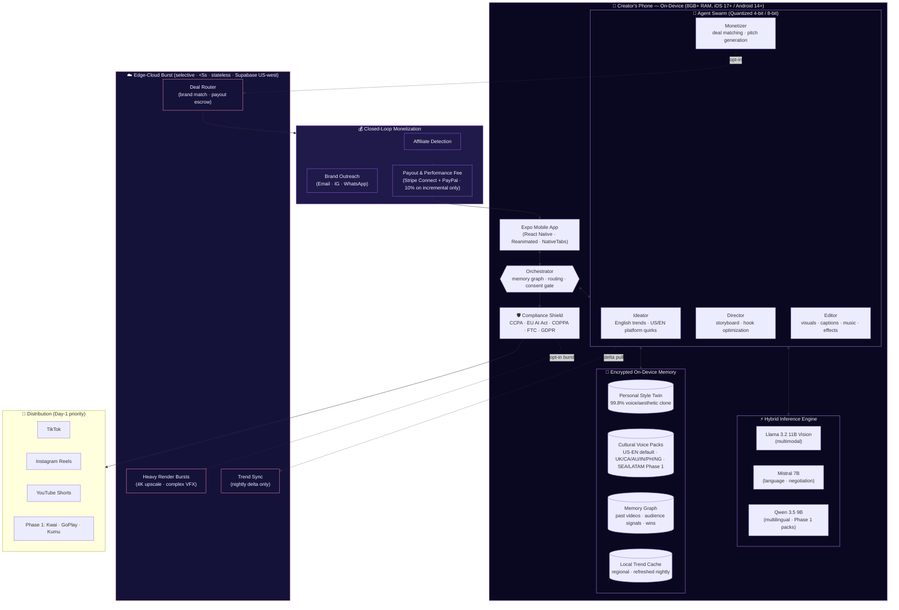
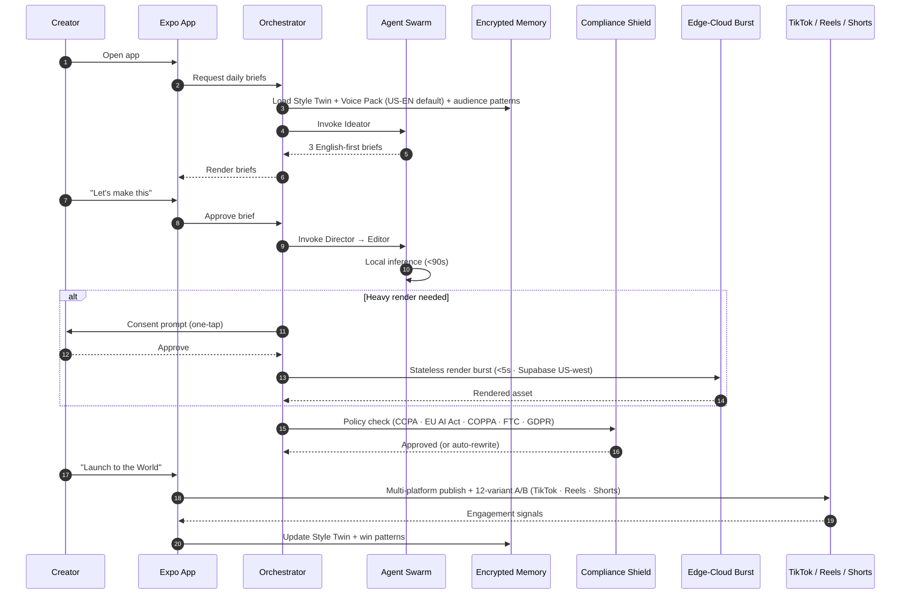

# Lumina — Architecture

> **Immutable v2.0 blueprint:** an autonomous, privacy-first GenAI creative swarm that lives inside the creator's phone, operates a closed-loop monetization flywheel, and ships **English-first / US-first** by default with a modular Cultural Voice Pack system that layers UK/CA/AU/IN/PH/NG on Day 1 and SEA/LATAM in Phase 1.

This document defines the architectural blueprint for Lumina. It is the single source of truth for how the agent swarm, on-device inference engine, edge-cloud burst layer, and monetization pipeline fit together.

---

## Architectural Principles

1. **On-device first, always.** Inference, memory, and Style Twin storage live on the device. Cloud is a burst layer, not a default path.
2. **Zero-trust egress.** No raw footage, voice, or biometric signal leaves the device without explicit per-action consent.
3. **Swarm over monolith.** Specialized agents collaborate via a shared memory graph. No single agent owns the full pipeline.
4. **Compliance is a runtime concern, not a review.** The Compliance Shield gates every outbound post — tuned to **US/EU policies first** (CCPA, EU AI Act, COPPA, FTC disclosure, GDPR).
5. **Cultural intelligence is a first-class subsystem — English-first.** Trend, language, and platform signals ship Day 1 for US English (primary) plus UK / CA / AU / IN-EN / PH-EN / NG-EN via the **Cultural Voice Pack** system. Bahasa, Tagalog, Vietnamese, Thai, Portuguese-BR, Spanish-MX/CO/AR are loadable Phase 1 modules over the same interface.
6. **Determinism where the creator notices, learning where they don't.** UX is predictable; ranking and matching are adaptive.

---

## System Overview



---

## The Agent Swarm

| Agent | Responsibility | Primary Model | Inputs | Outputs |
|---|---|---|---|---|
| **Orchestrator** | Routes intents, enforces consent gates, maintains memory graph coherence | Mistral 7B | User intent, memory graph, agent state | Agent invocation plan |
| **Ideator** | Mines English-first trends, generates 3 daily US/EN-relevant opportunities (UK/CA/AU/IN/PH/NG aware via Voice Pack) | Qwen 3.5 9B | Trend cache, Style Twin, active Voice Pack | Scripted brief with hook, beat, cultural tag |
| **Director** | Translates briefs into shot-by-shot storyboards, optimizes the 0.5–3s hook | Llama 3.2 11B Vision | Brief, Style Twin, audience win patterns | Storyboard, shot list, hook variants |
| **Editor** | Renders visuals, captions, music, effects in <90s | Llama 3.2 11B Vision | Storyboard, raw footage, music library | Final 15–90s video file |
| **Monetizer** | Detects affiliate fits, drafts brand pitches, drafts manual outreach (sent only on user tap) | Mistral 7B | Video metadata, brand graph, past deals | Outreach drafts, pitch decks, deal terms |

Agents communicate exclusively through the shared **Memory Graph**. No agent calls another directly — the Orchestrator routes all transitions, which makes the swarm debuggable, replayable, and consent-auditable.

### Cultural Voice Pack System

The Twin owns the creator's voice. The **Voice Pack** layers a culture on top — humor reference set, slang dictionary, lighting/aesthetic priors, platform-quirk weights — without retraining the Twin. Day-1 packs:

| Pack | Locale | Status |
|---|---|---|
| **US-EN (Gen-Z)** | en-US | Default · Day 1 |
| **UK-EN** | en-GB | Day 1 |
| **CA-EN** | en-CA | Day 1 |
| **AU-EN** | en-AU | Day 1 |
| **IN-EN** | en-IN | Day 1 |
| **PH-EN (Taglish-aware)** | en-PH | Day 1 |
| **NG-EN (Pidgin-aware)** | en-NG | Day 1 |
| pt-BR · id-ID · vi-VN · th-TH · es-MX/CO/AR | … | **Phase 1** (months 2–6) |

Packs are modular on-device vector-store extensions — switching packs is instant, training is unchanged.

---

## On-Device / Edge-Cloud Hybrid



## Quantization Spec

| Model | Role | Precision | On-Device Footprint | Notes |
|---|---|---|---|---|
| **Llama 3.2 11B Vision** | Director, Editor (multimodal) | **4-bit (Q4_K_M)** | ~6.2 GB | Vision-text fusion for storyboards, palette, framing |
| **Mistral 7B** | Orchestrator, Monetizer (language + negotiation) | **4-bit (Q4_K_M)** | ~4.0 GB | Low-latency routing and outreach drafting |
| **Qwen 3.5 9B** | Ideator (multilingual cultural intelligence) | **8-bit (Q8_0)** | ~9.0 GB *(loaded on demand)* | Native en-* + (Phase 1) pt-BR, id-ID, vi-VN, th-TH, tl-PH, es-MX/CO/AR |
| **Whisper-tiny** | Voice features for Style Twin | **4-bit** | ~150 MB | Pacing, energy, transcription only — never streamed |
| **TitaNet-small** | Speaker embedding for Style Twin | **fp16** | ~80 MB | 192-dim timbre vector |

**Loader policy:** Llama and Mistral remain warm. Qwen is paged in only when the Ideator runs (nightly + on demand). Total resident memory budget: **≤ 5.5 GB on 8 GB devices**, **≤ 12 GB on 12 GB+ devices** (Qwen warm).

**Runtime:** [`react-native-executorch`](https://github.com/software-mansion/react-native-executorch) for Llama / Mistral / Whisper / TitaNet. Qwen via [`llama.rn`](https://github.com/mybigday/llama.rn) with mmap-backed lazy load.

---

**Burst rules** — the edge-cloud layer is invoked only when:

1. The render exceeds the device's thermal/memory budget (4K upscale, 3D VFX, multi-track music synthesis).
2. The user has explicitly opted in for that action.
3. The payload is **stateless** — no creator identity, no Style Twin, no raw audio. The burst layer never persists creator data.
4. Hosted in **Supabase US-west** for CCPA-default residency.

Trend sync is a **delta-only nightly pull** of regional trend metadata (no per-creator queries).

---

## Privacy & Consent Model

| Surface | Default | Opt-in Required For |
|---|---|---|
| Raw video / audio | Stays on device | Heavy render burst (per-action, scoped) |
| Style Twin | Encrypted on device | Never leaves device — zero exceptions |
| Memory graph | Encrypted on device | Cross-device sync (future, opt-in) |
| Engagement signals | Stays on device | Aggregated trend contribution (off by default) |
| Brand outreach drafts | Stays on device | Sent only on user's explicit tap |

**Compliance Shield** runs as an in-process policy engine on every outbound asset before publish. Tuned to **US/EU policies first** — CCPA, EU AI Act, COPPA, FTC disclosure, GDPR — with TikTok / Reels / Shorts as Day-1 packs. Kwai / GoPlay-ID / Kumu-PH packs ship pre-wired so Phase 1 SEA/LATAM expansion is a config flip, not a refactor. Flagged content is either auto-rewritten by the Editor or blocked with an explanation.

---

## Monetization Architecture

| Layer | Day-1 (US-first) | Phase 1 (SEA/LATAM layered) |
|---|---|---|
| **Performance fee** | 10% of incremental revenue Lumina creates, audit-trailed via FNV-1a hash chain | Same engine, no change |
| **Affiliate detection** | Amazon Associates, Linktree, TikTok Shop, Rakuten | Shopee, Lazada, Tokopedia, Magalu, Mercado Livre, Kwai Shop |
| **Brand outreach** | Email + IG DM + WhatsApp drafts (manual-send gate) | Same |
| **Payout rails** | **Stripe Connect + PayPal instant** (US bank accounts first) | Pix · GCash · OVO · SPEI · PromptPay · Wise |
| **Pricing** | Spark free (3 videos/day) · Lumina Pro $12.99/mo · 10% performance fee | Same headline; localized currency display |

Sprint 4 ships the engine end-to-end behind these interfaces — Sprint 5 swaps the Stripe/PayPal adapters in behind `PayoutGateway` without touching call sites.

---

## Repository Layout

```
artifacts/
├── lumina/             # Expo mobile app — the product surface
├── api-server/         # DEPRECATED · reserved for Sprint 3 burst layer
└── mockup-sandbox/     # Canvas for UI exploration
packages/
├── style-twin/         # Personal Style Twin (Sprint 1) — types, train/retrain, encrypted storage, ExecuTorch adapter
├── swarm-studio/       # Orchestrator + 4 agents + memory graph contracts (Sprint 2)
├── compliance-shield/  # Per-platform policy engine + auto-rewrite + 368-sample red-team corpus (Sprint 3)
├── monetizer/          # 10% performance-fee accounting + Stripe/PayPal-first payout rails (Sprint 4)
├── edge-cloud/         # Stateless burst client + nightly trend delta (Sprint 2/3)
├── api-spec/           # OpenAPI single source of truth
├── api-client-react/   # Generated React Query hooks (Orval)
└── api-zod/            # Generated Zod schemas (Orval)
.agents/                # Agent definitions, prompts, memory-graph schemas
scripts/                # Repo-wide tooling
```

Workspace conventions: pnpm workspaces, TypeScript project references, OpenAPI-first contracts, Orval codegen, Pino for structured logging. Encrypted device keystores (iOS Keychain / Android Keystore via `expo-secure-store`) are the only persistence layer for creator data; cloud burst payloads are stateless and hosted in **Supabase US-west**.

---

## Non-Functional Requirements

| Concern | Target |
|---|---|
| End-to-end video generation (script → export) | < 90s on-device |
| Heavy render burst | < 5s additional |
| Cold app start | < 1.5s on iPhone 13 / Pixel 7 |
| Style Twin retrain | < 8s incremental |
| Offline coverage | 70% of features fully usable offline |
| Crash-free sessions | ≥ 99.7% |
| Compliance Shield latency | < 250ms per asset |
| Battery cost per video | ≤ 3% on 4000mAh device |
| Test coverage | ≥ 85% lines, 100% on monetization & consent paths |

---

## Threat Model — Top 5

1. **Style Twin exfiltration** — mitigated by on-device encrypted storage + zero cloud sync by default.
2. **Platform policy drift** — mitigated by Compliance Shield + multi-platform redundancy + nightly policy delta pull.
3. **Deal-router fraud / fake brands** — mitigated by escrowed payouts + brand graph reputation scoring.
4. **Trend-cache poisoning** — mitigated by signed delta pulls and on-device anomaly detection.
5. **Voice-clone misuse** — mitigated by radical transparency (every agent shows reasoning) + one-tap human override + watermarking on every outbound asset.

---

## Decision Log

Architectural decisions of consequence are recorded as ADRs in `docs/adr/NNNN-title.md`. The first ADR locks the immutable v2.0 blueprint (US-first / English-first GTM).
