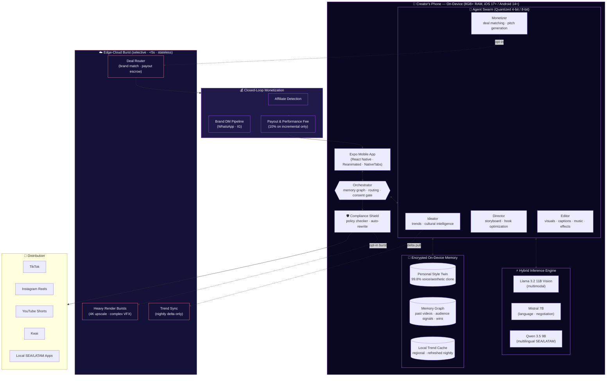
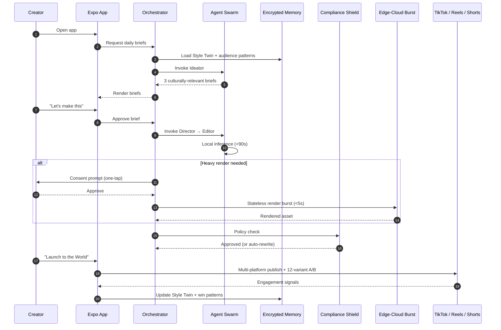

# Lumina — Architecture

> **Immutable v1.0 vision:** an autonomous, privacy-first GenAI creative swarm that lives inside the creator's phone and operates a closed-loop monetization flywheel.

This document defines the architectural blueprint for Lumina. It is the single source of truth for how the agent swarm, on-device inference engine, edge-cloud burst layer, and monetization pipeline fit together.

---

## Architectural Principles

1. **On-device first, always.** Inference, memory, and Style Twin storage live on the device. Cloud is a burst layer, not a default path.
2. **Zero-trust egress.** No raw footage, voice, or biometric signal leaves the device without explicit per-action consent.
3. **Swarm over monolith.** Specialized agents collaborate via a shared memory graph. No single agent owns the full pipeline.
4. **Compliance is a runtime concern, not a review.** The Compliance Shield gates every outbound post.
5. **Cultural intelligence is a first-class subsystem.** Trend, language, and platform signals are localized per region (Bahasa, Tagalog, Vietnamese, Thai, Portuguese-BR, Spanish-MX/CO/AR).
6. **Determinism where the creator notices, learning where they don't.** UX is predictable; ranking and matching are adaptive.

---

## System Overview



---

## The Agent Swarm

| Agent | Responsibility | Primary Model | Inputs | Outputs |
|---|---|---|---|---|
| **Orchestrator** | Routes intents, enforces consent gates, maintains memory graph coherence | Mistral 7B | User intent, memory graph, agent state | Agent invocation plan |
| **Ideator** | Mines local + global trends, generates 3 daily culturally-relevant opportunities | Qwen 3.5 9B | Trend cache, Style Twin, regional signals | Scripted brief with hook, beat, cultural tag |
| **Director** | Translates briefs into shot-by-shot storyboards, optimizes the 0.5–3s hook | Llama 3.2 11B Vision | Brief, Style Twin, audience win patterns | Storyboard, shot list, hook variants |
| **Editor** | Renders visuals, captions, music, effects in <90s | Llama 3.2 11B Vision | Storyboard, raw footage, music library | Final 15–90s video file |
| **Monetizer** | Detects affiliate fits, drafts brand pitches, negotiates micro-deals | Mistral 7B | Video metadata, brand graph, past deals | DM drafts, pitch decks, deal terms |

Agents communicate exclusively through the shared **Memory Graph**. No agent calls another directly — the Orchestrator routes all transitions, which makes the swarm debuggable, replayable, and consent-auditable.

---

## On-Device / Edge-Cloud Hybrid



**Burst rules** — the edge-cloud layer is invoked only when:

1. The render exceeds the device's thermal/memory budget (4K upscale, 3D VFX, multi-track music synthesis).
2. The user has explicitly opted in for that action.
3. The payload is **stateless** — no creator identity, no Style Twin, no raw audio. The burst layer never persists creator data.

Trend sync is a **delta-only nightly pull** of regional trend metadata (no per-creator queries).

---

## Privacy & Consent Model

| Surface | Default | Opt-in Required For |
|---|---|---|
| Raw video / audio | Stays on device | Heavy render burst (per-action, scoped) |
| Style Twin | Encrypted on device | Never leaves device — zero exceptions |
| Memory graph | Encrypted on device | Cross-device sync (future, opt-in) |
| Engagement signals | Stays on device | Aggregated trend contribution (off by default) |
| Brand DM drafts | Stays on device | Sent only on user's explicit tap |

**Compliance Shield** runs as an in-process policy engine on every outbound asset before publish. Flagged content is either auto-rewritten by the Editor or blocked with an explanation.

---

## Repository Layout

```
artifacts/
├── lumina/         # Expo mobile app — the product surface
├── api-server/     # Express 5 — Compliance Shield API, deal router, payout escrow
└── mockup-sandbox/ # Canvas for UI exploration
lib/
├── api-spec/       # OpenAPI single source of truth
├── api-client-react/ # Generated React Query hooks (Orval)
├── api-zod/        # Generated Zod schemas (Orval)
└── db/             # Drizzle schemas + migrations
.agents/            # Agent definitions, prompts, memory-graph schemas
scripts/            # Repo-wide tooling
```

Workspace conventions: pnpm workspaces, TypeScript project references, OpenAPI-first contracts, Orval codegen, Drizzle for persistence, Pino for structured logging.

---

## Non-Functional Requirements

| Concern | Target |
|---|---|
| End-to-end video generation (script → export) | < 90s on-device |
| Heavy render burst | < 5s additional |
| Cold app start | < 1.5s on iPhone 13 / Pixel 7 |
| Style Twin retrain | < 8s incremental |
| Offline coverage | 70% of features fully usable offline |
| Crash-free sessions | ≥ 99.7% |
| Compliance Shield latency | < 250ms per asset |
| Battery cost per video | ≤ 3% on 4000mAh device |
| Test coverage | ≥ 85% lines, 100% on monetization & consent paths |

---

## Threat Model — Top 5

1. **Style Twin exfiltration** — mitigated by on-device encrypted storage + zero cloud sync by default.
2. **Platform policy drift** — mitigated by Compliance Shield + multi-platform redundancy + nightly policy delta pull.
3. **Deal-router fraud / fake brands** — mitigated by escrowed payouts + brand graph reputation scoring.
4. **Trend-cache poisoning** — mitigated by signed delta pulls and on-device anomaly detection.
5. **Voice-clone misuse** — mitigated by radical transparency (every agent shows reasoning) + one-tap human override + watermarking on every outbound asset.

---

## Decision Log

Architectural decisions of consequence are recorded as ADRs in `docs/adr/NNNN-title.md`. The first ADR locks the immutable v1.0 vision.
